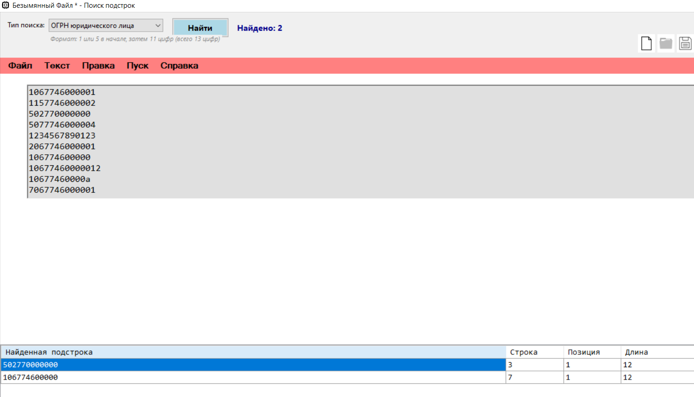
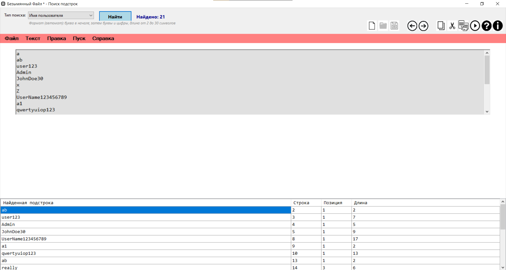
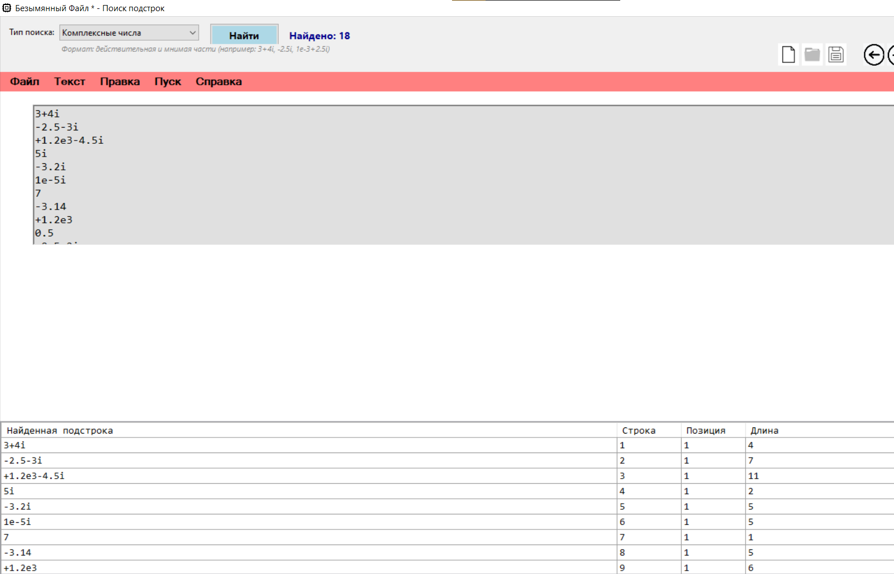
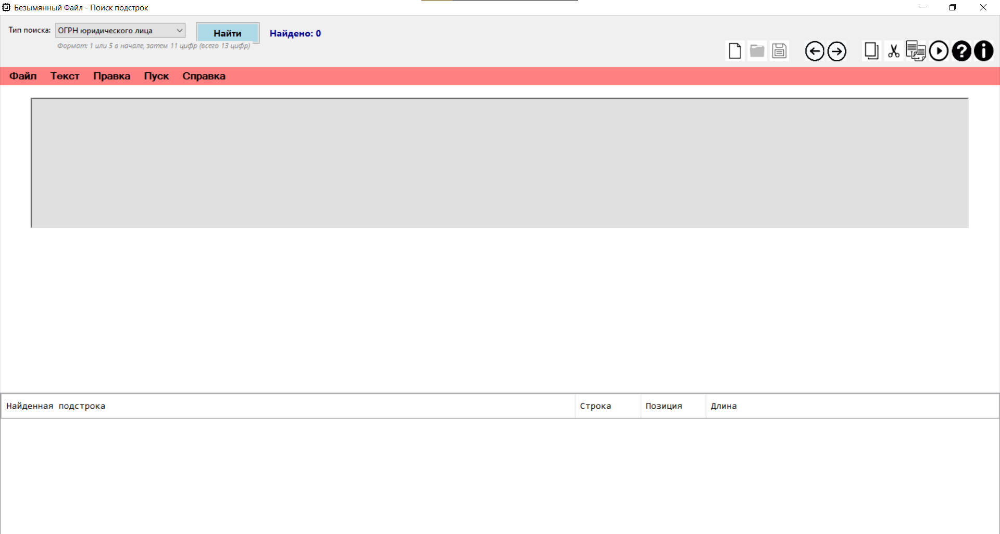

# Лабораторная работа: Разработка лексического анализатора для поиска подстрок

## Название и цель лабораторной работы

**Название:** Разработка лексического анализатора с использованием регулярных выражений и конечных автоматов

**Цель работы:** Изучение методов лексического анализа, разработка алгоритмов поиска подстрок с использованием регулярных выражений и конечных автоматов, создание приложения для анализа текста и поиска заданных паттернов.

## Сведения об авторе

| Поле | Значение |
|------|----------|
| **Студент** | Соболев Илья Олегович |
| **Группа** | АВТ-313 |
| **Факультет** | АВТФ |
| **Дата выполнения** | 06.04.2026 |
| **Преподаватель** | Антонянц Е.Н. |

## Постановка задачи

Разработать лексический анализатор для поиска в тексте следующих паттернов:

1. **ОГРН юридического лица** — 13-значный цифровой код, начинающийся с 1 или 5
2. **Имя пользователя (Username)** — латинские буквы и цифры, первый символ — буква, длина от 2 до 30 символов
3. **Комплексные числа** — числа в формате a+bi, a-bi, +a+bi, -a-bi, a+i, i и т.д.

---

## Решение задачи 1: Поиск ОГРН юридического лица

### Описание задачи

ОГРН (Основной Государственный Регистрационный Номер) — это уникальный идентификатор юридического лица в России. Он представляет собой 13-значное число, где:
- 1-й знак — признак отнесения государственного регистрационного номера записи (1 или 5)
- Остальные 12 знаков — порядковый номер

Необходимо найти все вхождения 13-значных чисел, начинающихся с 1 или 5.

### Регулярное выражение

\b[15][0-9]{11}\b

Пояснение обозначений

\b	Граница слова — число должно быть отдельным словом

[15]	Набор символов — цифра 1 или 5 (первая цифра ОГРН)

[0-9]{11}	Любая цифра от 0 до 9, повторенная ровно 11 раз

\b	Граница слова — завершающая граница

Примеры строк:

1067746000001

1157746000002

502770000000

5077746000004

1234567890123

2067746000001

106774600000

10677460000012

10677460000a

7067746000001



## Решение задачи 2: Поиск имени пользователя (с использованием конечного автомата)

### Описание задачи

Username (имя пользователя) используется в системах аутентификации и должен соответствовать следующим правилам:

Первый символ — буква латинского алфавита (A-Z, a-z)

Последующие символы — буквы латинского алфавита или цифры (0-9)

Минимальная длина — 2 символа

Максимальная длина — 30 символов

Username является отдельным словом (ограничен границами)

Диаграмма переходов автомата
![Граф автомата]

Примеры строк:

Тест: Поиск username в тексте

Входной текст:

a

ab

user123

Admin

JohnDoe30

x

Z

UserName123456789

a1

qwertyuiop123

1user

ab

a_really_long_username_that_exceeds_thirty_characters_123

user-name

user name

user@name

12345

A

Результат поиска (автомат):


## Решение задачи 3: Поиск комплексных чисел

### Описание задачи
Комплексные числа могут быть представлены в различных форматах:

Только действительная часть: 3, -2.5, 1e-3

Только мнимая часть: 4i, -2.5i, 1e-3i

Полная форма: 3+4i, -2.5-1.5i, 1e-3+2.5i

Допускаются пробелы вокруг знака: 3 + 4i

Регулярное выражение

^[+-]?\d+(?:\.\d+)?(?:[eE][+-]?\d+)?(?:\s*[+-]\s*[+-]?\d+(?:\.\d+)?(?:[eE][+-]?\d+)?i)?$|^[+-]?\d+(?:\.\d+)?(?:[eE][+-]?\d+)?i$

Пояснение обозначений

Часть выражения	Описание

^	Начало строки

[+-]?	Опциональный знак (+ или -)

\d+	Одна или более цифр

(?:\.\d+)?	Опциональная дробная часть

(?:[eE][+-]?\d+)?	Опциональная экспоненциальная часть

(?:\s*[+-]\s*[+-]?\d+(?:\.\d+)?(?:[eE][+-]?\d+)?i)?	Опциональная мнимая часть

$	Конец строки

|	ИЛИ (для форм только с мнимой частью)

Примеры строк:

3+4i

-2.5-3i

+1.2e3-4.5i

5i

-3.2i

1e-5i

7

-3.14

+1.2e3


0.5

-0.5+2i

3++4i

3+4

3+4ij

i

3+4i+5

3+4i2

.5i

3.+4i

3+4I

3 + 4i

3+4*i

(3+4i)

3.14i

-1e-10+2.5e5i

Результаты поиска:



Интерфейс приложения

Главное окно


### Функциональность

| Функция | Описание |
|---------|----------|
| **Выбор типа поиска** | Выпадающий список с тремя типами паттернов |
| **Отображение описания** | Показ формата для выбранного типа поиска |
| **Кнопка "Найти"** | Выполнение поиска по тексту |
| **Таблица результатов** | Колонки: подстрока, строка, позиция, длина |
| **Подсветка** | Жёлтая подсветка найденной подстроки при выборе в таблице |
| **Счётчик** | Отображение количества найденных совпадений |

## Горячие клавиши

| Комбинация | Действие |
|------------|----------|
| `Ctrl+N` | Новый файл |
| `Ctrl+O` | Открыть файл |
| `Ctrl+S` | Сохранить файл |
| `Ctrl+Shift+S` | Сохранить как |
| `Ctrl+Z` | Отменить |
| `Ctrl+Y` | Повторить |
| `Ctrl+X` | Вырезать |
| `Ctrl+C` | Копировать |
| `Ctrl+V` | Вставить |
| `Delete` | Удалить |
| `Ctrl+A` | Выделить всё |

---

## Результаты работы

В ходе выполнения лабораторной работы были решены следующие задачи:

### 1. Разработан лексический анализатор для поиска трёх типов паттернов в тексте

#### Поиск ОГРН (регулярное выражение `\b[15][0-9]{11}\b`)
- Успешно распознаёт 13-значные числа, начинающиеся с 1 или 5

- Корректно обрабатывает границы слов

#### Поиск Username (конечный автомат)
- Избежано сложное регулярное выражение
- Улучшена производительность на больших текстах
- Упрощена отладка и модификация правил
- Сложность алгоритма: **O(n)**

#### Поиск комплексных чисел
- Поддержка действительной и мнимой частей
- Поддержка экспоненциальной записи
- Поддержка пробелов вокруг знаков

### 2. Создано приложение Windows Forms с удобным пользовательским интерфейсом
- Поддержка работы с файлами
- Отмена/повтор действий
- Буфер обмена
- Подсветка результатов

---

## Сравнительный анализ

| Критерий | Регулярные выражения | Конечный автомат |
|----------|----------------------|------------------|
| Сложность реализации | Низкая | Средняя |
| Производительность | Средняя | Высокая (**O(n)**) |
| Читаемость кода | Низкая (для сложных паттернов) | Высокая |
| Отладка | Сложная | Простая |
| Модификация | Сложная | Простая |
| Поддержка | Встроенная в .NET | Самописная |

## Вывод

Применение **конечного автомата** для поиска username оказалось более эффективным по сравнению с регулярным выражением, так как:

- Обеспечивает линейную сложность **O(n)**
- Позволяет легко модифицировать правила поиска
- Упрощает отладку и понимание логики работы
- Даёт возможность визуализировать состояния автомата

---

## Приложение: Листинг кода

### Структура проекта
WindowsFormsApp2/
├── CompilerForm.cs # Главная форма приложения
├── LexicalAnalyzer.cs # Лексический анализатор
├── UsernameAutomaton.cs # Конечный автомат для username
├── SearchMatch.cs # Класс результатов поиска
└── Program.cs # Точка входа

### Основные классы

#### 1. `LexicalAnalyzer.cs`

```csharp
public class LexicalAnalyzer
{
    private readonly Dictionary<SearchPattern, Regex> _patterns;
    private readonly UsernameAutomaton _usernameAutomaton;

    public enum SearchPattern
    {
        OGRN,
        Username,
        ComplexNumber
    }

    public List<SearchMatch> FindMatches(string text, SearchPattern pattern)
    {
        // Реализация поиска
    }
}
2. UsernameAutomaton.cs

csharp
public class UsernameAutomaton
{
    private enum State { Start, FirstChar, Body, End, Error }
    
    public List<UsernameMatch> FindAll(string text)
    {
        // Реализация конечного автомата
    }
}
3. SearchMatch.cs

csharp
public class SearchMatch
{
    public string Value { get; set; }

    public int Line { get; set; }

    public int Column { get; set; }

    public int StartIndex { get; set; }

    public int Length { get; set; }
}

Дата выполнения: 06.04.2026